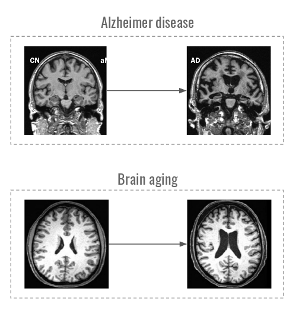

# mri-attribute-manipulation
Manipulation of MRI images according to Alzheimer disease stage and person age

### Overview 
**Goal**: simulate the process  of brain aging with and without Alzheimer disease on MRI images
* Fade MRI over age
* Fade MRI over stages of Alzheimer

**Motivation**: 
* observing the process of brain aging and Alzheimer disease progression  might help to predict possible complications 
* sophisticated data augmentation technique

**Data:**
. Subset of 4968 MRIs of 1582 patients taken in T1 modality was chosen. Data is **not** released in this repository, as the dataset is only available by request. For the most methods, a slice with maximal sum over transverse axis was chosen as a working slice. 

Distribution of Age and DX in the subset (Alzheimer-related score):

**Methods** &mdash; generative and optimization-based models:
* Deep Feature Interpolation ![[1]](https://arxiv.org/abs/1611.05507)
* IcGAN ![[2]](https://arxiv.org/abs/1611.06355)
* Fader Networks ![[3]](https://arxiv.org/abs/1706.00409)
* InfoGAN ![[4]](papers.nips.cc/paper/6398-infogan-interpretable-representation-learning-by-information-maximizing-generative-adversarial-nets)
* Visual Attribution GAN ![[5]](https://arxiv.org/abs/1711.08998)

### Results

Subjective rating:

|                            | Subjective rating on CelebA | Subjective rating on ADNI |
|----------------------------|-----------------------------|---------------------------|
| IcGAN                      | 3 / 5                       | 1.5 / 5                   |
| Deep Feature Interpolation | 4 / 5                       | 3   / 5                   |
| Fader Networks             | **5 / 5**                   | **3.5 / 5**               |
| InfoGAN                    | 4 / 5                       | 2   / 5                   |
| Visual Attribution GAN     |                             | **3.5 / 5**               |

* It was hard to evaluate models quantitatively on ADNI, since the dataset was relatively small, and it was difficult to train a well-performing predictor of age and diagnosis.
* While some of the models fail to yield diverse reconstructions that comply with prior knowledge about the disease, some of them, such as Fader Networks and Visual Attribution GAN, serve a decent proof of concept.
* It is suspected that using 3D as an input domain for all methods would produce much better results, as slices are subject to motion and misalignment. However, using 3D MRI images as input data is very computationally demanding for the most methods.

### Used third-party code
* Fader networks implementation: https://github.com/facebookresearch/FaderNetworks
* InfoGAN implementation: https://github.com/pianomania/infoGAN-pytorch
* Elements of code from https://github.com/znxlwm/pytorch-MNIST-CelebA-GAN-DCGAN for IcGAN implementation.

